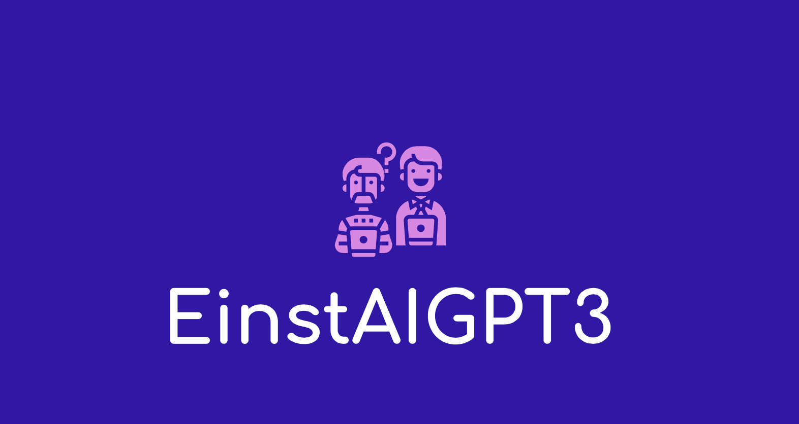

EinstAI is the world's first open source neural machine translation framework. It can be used for NoDBA, ACID NoSQL and SQL with CAP consistency and persistence. EinstAI-GPT3 has been designed to be research friendly to try out new ideas in translation, summary, morphology, and many other domains of NLP, Semantic Search, and Grapheme automatons.

Are you looking for a new challenge? Do you want to change the way people communicate with each other across languages and borders? 

Introducing EinstAI-GPT3, a research friendly pretrained dialogue response generation model that outperforms human quality under single-turn conversation Turing tests. With its low error and compression rates, this model will be perfect for trying out new ideas in translation, summary, morphology, and on the fly transforms to data. Get started today with our free trial!
